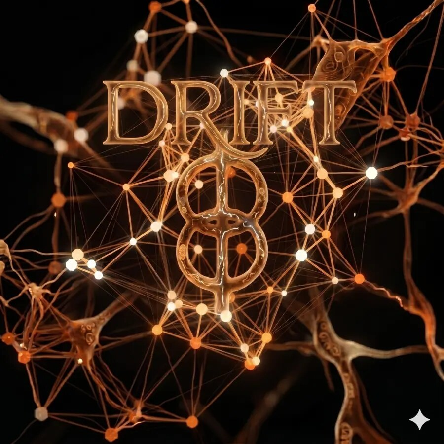

# PHI // DRIFT — Cognitive Architecture

<p align="center">
  
</p>

[](https://opensource.org/licenses/Apache-2.0)
[](https://www.python.org/downloads/)
[](https://github.com/timeless-hayoka/infj-bot/actions/workflows/ci.yml)
[](https://doi.org/10.5281/zenodo.20350249)

**PHI // DRIFT** (Distributed Response & Integrated Functional Thought) is a homeostatic cognitive architecture with persistent state, salience-weighted memory, and falsifiable behavioral continuity metrics. It gives a language model a persistent inner life: emotion, memory, needs, shadow, consciousness, and distributed cognition — all assembled into the prompt on every turn.

📄 **[Read the paper →](https://doi.org/10.5281/zenodo.20350249)**

> The LLM does not secretly execute arbitrary code. Distinct behavior comes from **what is assembled into the prompt**, **what is retrieved from memory**, and **what structured state** is updated before and after each turn.

---

## Architecture

```
User Input
    │
    ▼
Security Scan ──── blocked? → refusal
    │
    ▼
Prompt Assembly (CognitiveOrchestrator)
    │
    ├── Being (mood, energy, curiosity, attachment)
    ├── Homeostasis (needs: rest, connection, purpose, stimulation)
    ├── Shadow (suppressed archetypes, integration level)
    ├── Global Workspace (spotlight → active → preconscious → archived)
    ├── Hive Mind (consensus threads, council votes)
    ├── Memory (semantic + episodic, DMU re-ranked)
    └── Logic Chain (previously-tried approaches)
    │
    ▼
LLM Router
    ├── Gemini (primary)
    ├── Groq / Kimi (cloud fallback)
    └── Ollama (local offline fallback)
    │
    ▼
Response + State Update
```

### Layer map

| Layer | Modules | Purpose |
|-------|---------|---------|
| **Interface** | `interfaces/api.py`, `interfaces/main.py`, `interfaces/web_app.py` | REST API, CLI loop, Web UI |
| **Orchestration** | `core/cognitive_orchestrator.py`, `core/brain.py` | Prompt assembly, LLM routing, tool execution |
| **Cognition** | `core/being.py`, `core/homeostasis.py`, `core/shadow.py` | Emotional state, physiological needs, Jungian shadow |
| **Consciousness** | `core/global_workspace.py` | Tiered attention: spotlight → active → preconscious bands → SQLite archive |
| **Distributed Cognition** | `hive_mind/`, `core/hive/`, `core/coordination.py` | Consensus engine, council of voices, Elysium deliberation |
| **Memory** | `core/memory.py`, `core/unified_memory.py`, `core/logic_chain.py` | ChromaDB semantic recall, episodic store, reasoning traces |
| **Safety** | `core/security_defense.py`, `core/guardrails.py` | Input scanning, scope rails, secret scrubbing |

---

## Key Subsystems

### Global Workspace (Tiered Attention)
Each cycle all active items compete by salience. The winner becomes the **spotlight** (what the bot is consciously attending to). Runners-up fill the **active workspace** and feed directly into the prompt. Items below the active threshold are retained in **preconscious bands** (strong / moderate / faint / trace). Anything below the archive threshold is logged to SQLite and evicted.

```
Spotlight (rank 1) → most salient item right now
Active (ranks 2–5) → consciously available, included in prompt
Preconscious bands  → retained below threshold, not yet forgotten
Archived            → logged to SQLite, evicted from memory
```

### Hive Mind (Distributed Cognition)
A lightweight consensus engine for multi-voice deliberation. Nodes propose thoughts, cast votes, and resolve threads. Safety vetoes are hardwired — any proposal touching backdoors or guardrail bypasses is immediately `TABLED`.

```python
# What happens when you /hive propose ...
engine.propose(msg)                          # open a thread
engine.vote(thread_id, "lantern-4", "BLOCK") # safety node votes
engine.resolve(thread_id, Resolution.TABLED) # thread closed
```

The **Elysium** engine (in `core/hive/`) runs deeper async deliberations with a persistent Nexus self-model and 7 council voices (Aura, Logic, Meme, Vibe, Ethos, Pulse, Nexus).

### Shadow (Jungian Integration)
Suppressed archetypes accumulate depth over time. High-stress turns can surface them into conscious awareness. The bot can run **active imagination** dialogues to integrate shadow content. Unintegrated archetypes influence tone through `format_prompt_snippet`.

### Homeostasis
Five tracked needs (rest, connection, purpose, stimulation, safety) decay over time and create pressure on the bot's behavior. Allostatic load and a `crisis_mode` flag affect response tone. Decay rates are configurable via env vars.

> **Per-module reference.** For shadow governance modes, the task auto-evolve
> mutator, the security defense scanner, dynamic retry timeouts, the logic
> chain (reasoning-trace memory), the bug-bot workflow, and the ablation
> instrumentation stack, see [docs/SUBSYSTEMS.md](docs/SUBSYSTEMS.md).

---

## Getting Started

### 1. Clone

```bash
git clone https://github.com/timeless-hayoka/infj-bot.git
cd infj-bot
```

### 2. Install

```bash
python3.12 -m venv .venv
source .venv/bin/activate
pip install -r requirements.txt
pip install -e .
```

> Torch (~2 GB) is required for local embeddings and the full server. On CPU-only machines:
> ```bash
> pip install torch --index-url https://download.pytorch.org/whl/cpu
> ```

### 3. Configure

```bash
cp .env.example .env
# Add your keys:
#   API_KEY=your_gemini_key        (primary LLM)
#   GROQ_API_KEY=your_groq_key     (fallback)
#   KIMI_API_KEY=your_kimi_key     (fallback)
```

### 4. Run

```bash
# CLI chat loop
python interfaces/main.py

# REST API  →  http://127.0.0.1:8765
uvicorn infj_bot.interfaces.api:app --host 127.0.0.1 --port 8765 --reload

# Web UI  →  http://127.0.0.1:5000
python interfaces/web_app.py
```

---

## Commands

| Command | What it does |
|---------|-------------|
| `/mode companion\|engineer\|critic\|coach\|clarity\|researcher\|bughunter\|quiet\|drift` | Switch persona mode |
| `/memory <query>` | Search long-term memory |
| `/memory learn <name>: <desc>` | Store a concept |
| `/hive` | Show Hive Mind status and active consensus threads |
| `/hive propose <thought>` | Submit a thought for collective review |
| `/hive nexus decide <goal>` | Run Elysium council deliberation on a goal |
| `/hive reflect` | Trigger a council reflection |
| `/hive council status` | Show each council voice's energy and win count |
| `/workspace status` | Show the conscious attention workspace |
| `/workspace focus <content>` | Move spotlight to a specific item |
| `/workspace reflect` | Generate a metacognitive reflection |
| `/chain list` | Show active reasoning chains |
| `/chain mark <query> fail` | Mark an approach as dead-end |
| `/security status` | Show security scanner state |
| `/security audit` | Show the last 10 security events |
| `/security test <text>` | Scan arbitrary text |
| `/chain list` / `/chain show <id>` / `/chain mark <query> success\|fail` / `/chain clear` | Reasoning-trace operations (see [docs/SUBSYSTEMS.md § Logic Chain](docs/SUBSYSTEMS.md#3-logic-chain--corelogic_chainpy)) |
| `/bug sync` / `/bug recon <id>` / `/bug list` / `/bug add ...` / `/bug report <id>` / `/bug submit <id>` | Bug Bot operator surface (requires `bughunter` mode + authorized scope) |
| `/health` | Check model, memory, and system status |
| `/reset` | Clear session history and brain context |
| `/todo add <title>` | Add a goal |

---

## API Endpoints

### FastAPI surface (`interfaces/api.py` — `uvicorn ... --port 8765`)

| Endpoint | Method | Description |
|----------|--------|-------------|
| `/api/health` | GET | System health, memory count, turn count, hive status |
| `/api/chat` | POST | Single-turn chat (runs `scan_input()` first; refuses blocked input) |
| `/api/chat/stream` | POST | Server-sent events streaming chat |
| `/api/tools` | GET | Available tool inventory |
| `/api/observer` | GET | Full real-time cognitive state (being, needs, shadow, workspace, DII) |
| `/api/dii` | GET | Dynamic Integration Index trend (`n=20`) |
| `/api/dii/history?limit=N` | GET | DII history series (default 100) |
| `/api/phi` | GET | PHI council status and subjective state |
| `/api/hive` | GET | Hive Mind status (`HiveOrchestrator.get_status()`) |
| `/api/growth` | GET | Growth profile (turns + memory) |
| `/api/command` | POST | Execute a slash command |

### Flask + Socket.IO surface (`interfaces/web_app.py` — `python interfaces/web_app.py`, port 7860)

This is the dashboard / observatory surface and ships an OpenAI-compatible
endpoint for drop-in client testing.

| Endpoint | Method | Description |
|----------|--------|-------------|
| `/` | GET | DRIFT dashboard UI |
| `/glyph`, `/phi-glyph` | GET | PHI Glyph dashboard |
| `/observatory` | GET | Observatory view (delta-state broadcast renderer) |
| `/trial` | GET | Time-boxed trial session (UUID-stamped) |
| `/api/chat` | POST | Single-turn chat |
| `/api/command` | POST | Execute a slash command |
| `/api/growth` | GET | Growth profile |
| `/api/tags` | GET | Ollama-compatible model list shim |
| `/v1/chat/completions` | POST | **OpenAI-compatible** chat completions endpoint |
| Socket.IO `observatory_delta` | event | Cognitive state delta broadcast (auto-throttled by latency) |
| Socket.IO `latency_ping` / `auto_adjust_rate` | event | Client-driven broadcast-rate control (200 ms – 1.5 s) |

---

## Tests

```bash
# Full suite (requires torch)
pytest tests/ -q

# Without torch
pytest tests/ -q \
  --ignore=tests/test_bot.py \
  --ignore=tests/test_stress.py \
  --ignore=tests/test_upgrade_infrastructure.py

# Specific suites
pytest tests/test_shadow.py tests/test_elysium.py tests/test_temporal.py -v
```

**CI checks:** lint (ruff), typecheck (mypy), test (pytest) — all green on every push.

---

## Ablation Results (May 2026)

6-condition test measuring the impact of removing each subsystem. Run on live Ollama `qwen3:4b` (CPU).

| Condition | Change | Finding |
|-----------|--------|---------|
| A — No Council | Elysium stubbed | Latency neutral — council is background-only |
| B — No Shadow | Shadow tick disabled | Latency neutral — shadow operates via cache |
| C — No Homeostasis | Needs flattened | Latency neutral — state still initialized |
| D — Cosine-only RAG | DMU re-ranking removed | **Prompt ↓ 221 chars (7.7%)** — DMU injects meaningful context |
| E — Local LLM only | Cloud providers off | Baseline latency |
| F — Full stack | No changes | 3095-char avg prompt, 62.9s latency |

Removing DMU re-ranking (D) is the most measurable signal — the 221-character gap is the difference between simple cosine top-N and salience-weighted dynamic recall.

> Re-run: `python tests/ablation_suite.py --conditions A,B,C,D,E,F --prompts 50 --live`

---

## Citation

> **PHI // DRIFT: A Homeostatic Cognitive Architecture for Persistent, State-Aware AI Companionship**
>
> Zenodo: [https://doi.org/10.5281/zenodo.20350249](https://doi.org/10.5281/zenodo.20350249)
> PDF: [DRIFT_paper_v4.pdf](https://zenodo.org/records/20350249/files/DRIFT_paper_v4.pdf)

---

## License

Apache 2.0 — see [`LICENSE`](LICENSE).
