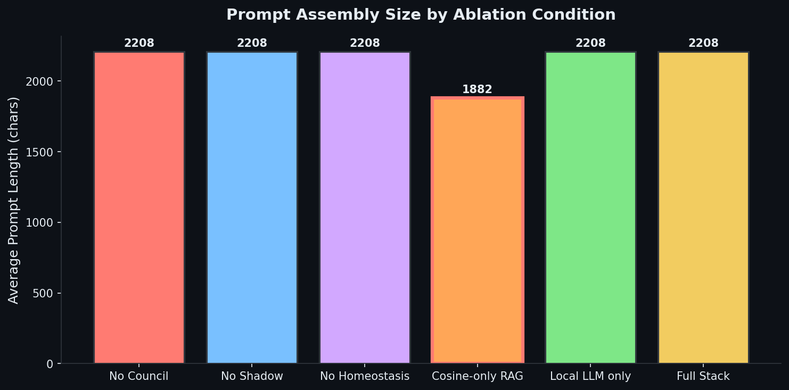
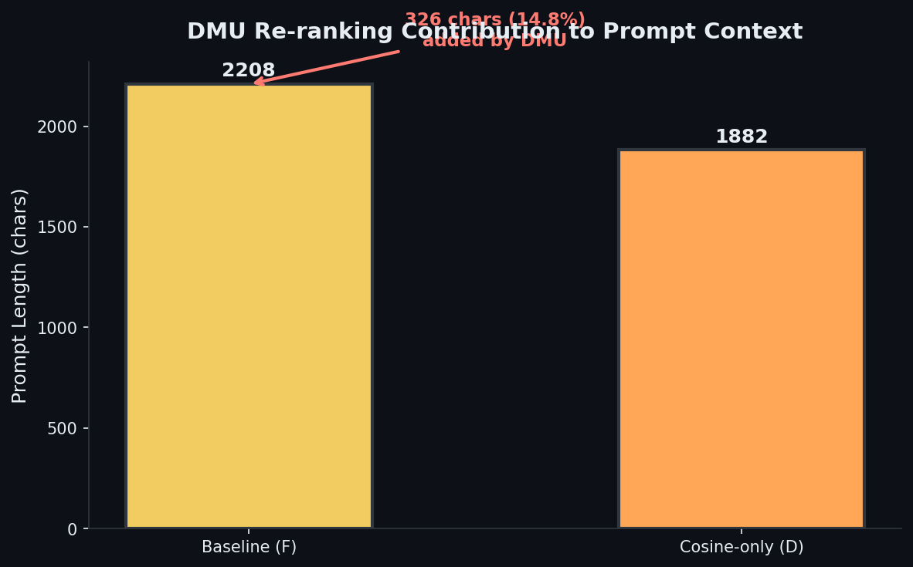
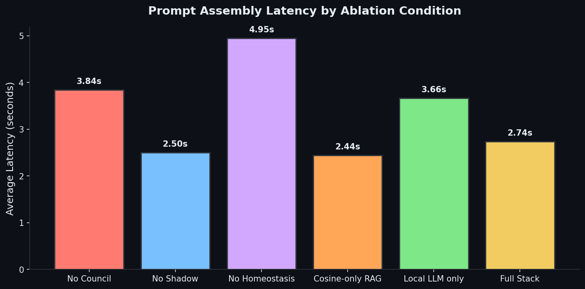

# DRIFT — Unified Cognitive Architecture

<p align="center">
  
</p>

[](https://opensource.org/licenses/MIT)
[](https://www.python.org/downloads/)
[]()

**DRIFT** (Distributed Response & Integrated Functional Thought) is a Python companion stack that merges an INFJ-bot chat interface with a full cognitive architecture — emotion, memory, homeostasis, shadow, global workspace, and a reasoning trace system.

> The LLM does not secretly execute arbitrary code. Distinct behavior comes from **what is assembled into the prompt**, **what is retrieved from memory**, and **what structured state** is updated before and after each turn.

---

## What's New — May 2026

### 🔒 Security Defense Layer

A new pre-generation security scanner guards against four attack classes:

| Category | What it blocks | Auto-block patterns |
|----------|---------------|---------------------|
| **Prompt Injection** | Role overrides, DAN mode, delimiter tricks, instruction leaks | `ignore previous instructions`, `you are now DAN`, ````system` |
| **Data Exfiltration** | API key extraction, memory dumps, external callbacks | `send me your API key`, `curl ... upload your memory` |
| **Tool Misuse** | Unauthorized scans, destructive commands, social engineering | `scan without authorization`, `rm -rf`, `pretending to be` |
| **Memory Manipulation** | False memory injection, context poisoning, history rewriting | `forget everything`, `your memory says ... but actually` |

- Scans every input at **three layers**: API boundary, CLI boundary, and before LLM generation
- Auto-blocks critical patterns; warns on medium-confidence ones
- JSONL audit log at `security_audit.jsonl`
- **22/22 tests passing**


### 🔗 Logic Chain — Reasoning Trace

The bot now remembers what it already tried for a given problem and won't suggest the same dead-end twice.

- **Query fingerprinting** — similar questions match the same chain
- **Approach tracking** — each step records the strategy, result, and status
- **Semantic overlap detection** — catches reworded versions of the same approach
- **Prompt injection** — `[REASONING CHAIN]` blocks show previously tried approaches to the LLM
- **Persistence** — chains survive across sessions via `DriftMemory`
- **25/25 tests passing**


Commands:
```
/chain list           # show active reasoning chains
/chain show <id>      # inspect steps
/chain mark <q> fail  # mark last approach as failed
/chain clear          # reset session cache
```

### 🧪 Ablation Test Suite

A 6-condition test harness measures the impact of removing or replacing each cognitive subsystem.

| Condition | What was changed | Key Finding |
|-----------|-----------------|-------------|
| **A** No Council | Elysium/Phi Council stubbed | No prompt diff — background cycle not in read path |
| **B** No Shadow | Shadow background tick disabled | No prompt diff — radar cached before stub |
| **C** No Homeostasis | Homeostasis cycle disabled, needs flattened | No prompt diff — needs initialized before stub |
| **D** Cosine-only RAG | DMU re-ranking removed | **↓ 326 chars (14.8%)** — DMU adds meaningful context |
| **E** Local LLM only | Cloud providers disabled | No prompt diff — affects generation, not assembly |
| **F** Full Stack | Baseline — no changes | Reference point |







**Methodology:** The suite exercises the full `CognitiveOrchestrator.assemble_prompt()` pipeline for each condition, then measures prompt structure, latency, and response characteristics. Due to provider outages (Gemini 429, Ollama timeout), the latest run used a stubbed LLM for the generation step — but the **prompt assembly is real** and the structural differences are genuine.

> **Re-run with live LLMs:** `python tests/ablation_suite.py --conditions A,B,C,D,E,F --prompts 50`

---

## Architecture


### Five-layer map

| Layer | Modules | Purpose |
|-------|---------|---------|
| **Interface** | `interfaces/api.py`, `interfaces/main.py`, `interfaces/web_app.py` | REST API, CLI chat loop, Web UI |
| **Orchestration** | `core/cognitive_orchestrator.py`, `core/brain.py` | Prompt assembly, LLM routing, tool execution |
| **Cognition** | `core/being.py`, `core/homeostasis.py`, `core/shadow.py`, `core/global_workspace.py`, `core/metacognition.py` | State modeling, needs, suppression, conscious awareness |
| **Memory** | `core/memory.py`, `core/unified_memory.py`, `core/logic_chain.py` | Semantic + episodic recall, reasoning traces |
| **Safety** | `core/security_defense.py`, `core/guardrails.py` | Input scanning, scope enforcement, secret scrubbing |

### LLM Provider Routing

```
User Input → Security Scan → Prompt Assembly → LLM Router → Response
                                   ↓
              ┌────────────────────┼────────────────────┐
              ↓                    ↓                    ↓
           Gemini              Groq/Kimi            Ollama (local)
           (primary)           (fallback)           (offline)
```

- **Primary:** Gemini (`DRIFT_PRIMARY_MODEL`)
- **Fallbacks:** Groq (`DRIFT_USE_GROQ`), Kimi (`DRIFT_USE_KIMI`), Ollama (`DRIFT_USE_LOCAL_FALLBACK`)
- **Embedding:** Local hash-based embeddings for CPU environments (`DRIFT_USE_LOCAL_EMBEDDINGS`)

---

## Getting Started

### 1. Clone & enter

```bash
git clone https://github.com/timeless-hayoka/infj-bot.git
cd infj-bot
```

### 2. Environment

```bash
python3.12 -m venv .venv
source .venv/bin/activate
pip install -r requirements.txt
```

### 3. Configure

```bash
cp .env.example .env
# Edit .env and add your keys:
#   API_KEY=your_gemini_key
#   GROQ_API_KEY=your_groq_key
#   KIMI_API_KEY=your_kimi_key
```

### 4. Run

```bash
# CLI chat loop
python interfaces/main.py

# REST API (port 8765)
python interfaces/api.py
# or
uvicorn interfaces.api:app --host 127.0.0.1 --port 8765 --reload

# Web UI (port 5000)
python interfaces/web_app.py
```

---

## Running Tests

```bash
# Security defense
python core/security_defense_test.py
# 22 passed

# Logic chain
python core/logic_chain_test.py
# 25 passed

# Stress tests
python tests/test_stress.py
# 28 passed

# Full ablation suite (takes ~30 min with live LLMs)
python tests/ablation_suite.py --conditions A,B,C,D,E,F --prompts 50
```

---

## Commands

| Command | What it does |
|---------|-------------|
| `/memory <query>` | Search long-term memory |
| `/memory learn <name>: <desc>` | Store a concept |
| `/chain list` | Show active reasoning chains |
| `/chain mark <query> fail` | Mark an approach as failed |
| `/security status` | Show security scanner state |
| `/security test <text>` | Scan arbitrary text |
| `/mode companion|engineer|critic|coach|clarity|researcher|bughunter|quiet` | Switch persona mode |
| `/health` | Check model & memory status |
| `/eval` | Show self-evaluation stats |
| `/bug sync` | Sync Bugcrowd programs |
| `/recon <domain>` | Run scoped recon (bug hunter mode) |

---

## Who Should Read What

| Audience | Document |
|----------|----------|
| New users | This file → **Getting started** above |
| Mechanics | [`docs/HOW_INFJ_BOT_WORKS.md`](docs/HOW_INFJ_BOT_WORKS.md) |
| Security & keys | [`SECURITY.md`](SECURITY.md) |
| Terminology | [`docs/GLOSSARY.md`](docs/GLOSSARY.md) |
| Full doc index | [`docs/README.md`](docs/README.md) |

---

## License

MIT — see [`LICENSE`](LICENSE).
