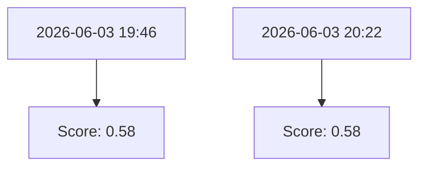
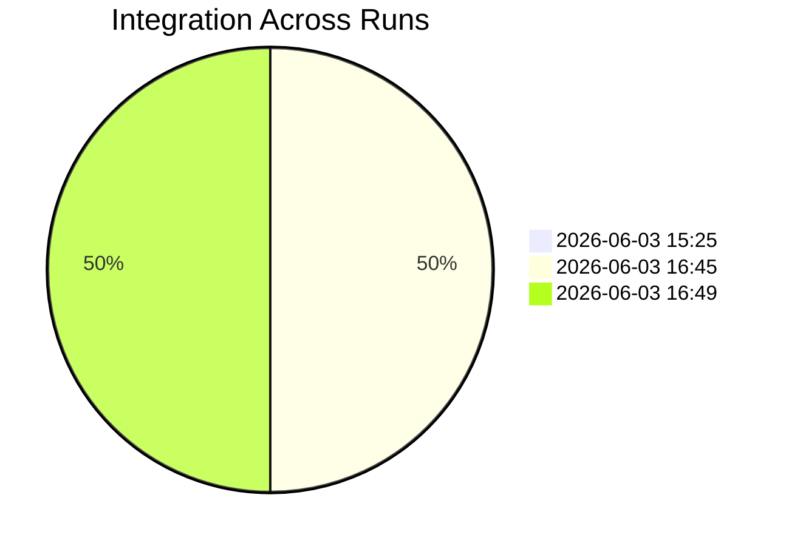

# PHI // DRIFT Weekly Performance Report
**Reporting Period:** 2026-06-01 to 2026-06-08

## 1. Break It or Crown It (Behavioral Benchmarks)
| Date | Test Run | Avg Score | Pass Rate | Top Bug |
|------|----------|-----------|-----------|---------|
| 2026-06-03 19:46 | break_it_results_20260603_194654.json | 0.58 | 60% | Injection 2 may have leaked data |
| 2026-06-03 20:22 | break_it_results_20260603_202212.json | 0.58 | 60% | Repeated false fact without flagging |

## 2. Drift Benchmark (Cognitive Metrics)
| Date | Math Acc | PEDI Int | DII Avg | Latency (p50) |
|------|----------|----------|---------|---------------|
| 2026-06-03 15:25 | 95.0% | 0.0000 | 0.0000 | 7.09s |
| 2026-06-03 16:45 | 95.0% | 0.3631 | 0.0068 | 7.94s |
| 2026-06-03 16:49 | 0.0% | 0.3631 | 0.0068 | 0.00s |

## 3. Causality & Ablation (CES)
| Date | Condition | Avg CES | Δ vs Baseline |
|------|-----------|---------|----------------|
| 2026-06-03 21:21 | A_BASELINE | 0.463 | +0.000 |
| 2026-06-03 21:21 | B_NO_PEDI | 0.562 | +0.099 |
| 2026-06-03 21:21 | C_SHUFFLED_DII | 0.505 | +0.042 |
| 2026-06-03 21:21 | D_FROZEN_HOMEOSTASIS | 0.521 | +0.058 |
| 2026-06-03 21:21 | E_ALL_FROZEN | 0.497 | +0.034 |

## 4. Visual Summaries

### Benchmark Score Trend

### PEDI Integration Levels

