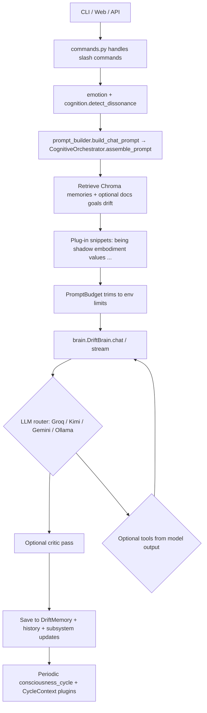

# How INFJ Bot Works — Architecture & Behavior (Shareable Overview)

This document explains **what INFJ Bot is made of**, **how one chat turn travels through the stack**, and **why conversation can feel continuity-rich** compared to a plain “LLM in a webpage.” It is written for collaborators, auditors, or friends who want the technical picture without reading the whole codebase.

**Repository:** [github.com/timeless-hayoka/infj-bot](https://github.com/timeless-hayoka/infj-bot)

INFJ Bot is a **Python application** centered on Google **Gemini** (with optional **Ollama** fallback). It stitches together **persistent vector memory**, **many small “cognitive” modules** (emotion, embodiment, shadow, goals, …), **prompt assembly with budgets**, and **optional tools** so the assistant can stay **on-tone, grounded, and stateful** across sessions.

---

## 1. The idea in one sentence

> **INFJ Bot = a policy-rich system prompt + ranked context + episodic/long-term recall + modeled inner state**, executed through a conductor (`CognitiveOrchestrator`), then **decoded by Gemini, Groq, Kimi, or Ollama** depending on availability (and optionally checked by a **critic** pass).

The model itself does **not** run arbitrary hidden code mid-reasoning unless **tools** are invoked through the guarded `tools.py` pathway. Almost everything distinctive about “personality continuity” happens **before** and **after** the model call: **what text you concatenate into the prompt** and **what you store when the answer returns**.

---

## 2. End-to-end flow (one user message)



**Plain-language steps**

1. **Input** arrives (terminal, Rich TUI, or FastAPI web UI → `main.py` / `api.py` paths).
2. **Slash commands** (`/memory`, `/mode`, …) short-circuit to `commands.py`.
3. **Offline emotion & dissonance heuristics** label the user turn (hints for stance and prompts).
4. **`build_chat_prompt`** builds the **full text** passed to Gemini: identity/mode rails, **being**, **workspace**, retrieved **memories**, **documents**, optional **Drift seeds**, cognitive plugin paragraphs, cyber boundaries, footer with the raw user message.
5. **`DriftBrain`** picks a provider through its router (see [§3.1](#31-brainpy--driftbrain)) — Groq → Kimi → Gemini (new `google.genai` SDK or legacy `google.generativeai`) → Ollama local — and either generates a single response or streams.
6. An optional **internal critic** re-reads the draft for grounding/safety persona issues.
7. **Tool calls** (if emitted) execute through **`tools.py`** with path limits, timeouts, and an **audit trail**.
8. **Persistence**: interaction text is scrubbed for secrets and written to **Chroma** (`memory.py`); session lines go to **`history.jsonl`**; subsystem objects update SQLite state (being, embodiment, shadow, …).
9. **Background**: an async **consciousness loop** runs phased **plugin cycles** every **15–30 seconds** in Strong Continuous Mode. Shadow, Homeostasis, and Being evolve continuously even when you're quiet — the bot maintains an ongoing inner life.

---

## 3. Core runtime components

### 3.1 `brain.py` — `DriftBrain`

- Holds **system prompts** for the primary companion (`INFJ_SYSTEM_PROMPT`)
  and for the optional internal **critic** (`CRITIC_SYSTEM_PROMPT`).
- All SDK / provider selection happens **once in `__init__`** (see *LLM
  provider routing*, below). Each chat turn dispatches to the chosen
  generator and falls forward only if the configured provider returns
  empty.
- Manages optional **streaming**, optional **parallel tool execution**, an
  in-memory + disk LRU `gen_cache` (`DiskGenCache`) keyed by
  `SHA256(model | system | prompt)`, and an `OllamaBridge` for the local
  fallback.
- Uses **`SelfEvaluator`** hooks where wired for reflective scoring (see
  `self_eval.py`).
- Persists a per-instance `ChainNavigator` (`logic_chain.py`) so reasoning
  traces survive across sessions through `DriftMemory`.

#### LLM provider routing

`DriftBrain.__init__` configures the SDK in this order (first match wins);
later turns still call providers in **routing priority** (Groq → Kimi →
Gemini → Ollama) within `_generate()`:

1. **Local fast-path.** If `DRIFT_PREFER_LOCAL=true` *and*
   `DRIFT_USE_LOCAL_FALLBACK=true` *and* `OllamaBridge.is_available()`
   succeeds, the brain marks `self.sdk = "local"` and short-circuits cloud
   client init (lowest latency for offline / CPU rigs).
2. **`google.genai`** (new SDK). If importable and `API_KEY` is set, the
   brain holds a `Client`; generation goes through
   `client.models.generate_content[_stream]`.
3. **`google.generativeai`** (legacy SDK). If the new SDK is missing but
   the legacy SDK is importable, the brain instantiates `GenerativeModel`
   objects for primary and critic with the system instructions
   pre-applied, and starts a chat session.
4. **No SDK.** Otherwise the brain operates in `sdk = "none"` test mode;
   only the local bridge / mocks can answer.

At call time, `_generate()` will still prefer Groq (`DRIFT_USE_GROQ` +
`GROQ_API_KEY`), then Kimi (`DRIFT_USE_KIMI` + `KIMI_API_KEY`), before
falling back to whatever Gemini SDK was set up in `__init__`, and finally
to the local bridge.

### 3.2 `memory.py` — `DriftMemory` (Chroma)

- **Collections**: semantic memories (`infj_semantic_memories`) when sentence-transformers embeddings are active; legacy hash embeddings use a parallel collection name.
- **Writes**: each saved turn includes scrubbed **`Jude:` / `Bot:`** content plus **metadata** (mode, emotion hints, importance, dissonance summary, timestamps, etc.).
- **Reads**: **`search`** for top‑k passages relevant to the current message (`INFJ_MEMORY_SEARCH_TOP_K`).
- **`scrub_text`**: strips likely **secrets** before storage (patterns + allowlists for UUIDs/git hashes).

### 3.3 `embeddings.py`

- Prefer **`sentence-transformers`** (`all-MiniLM-L6-v2` by default) for **real semantic retrieval**.
- Falls back to a **hash-based embedding** only when semantic models are unavailable (older compatibility path).

### 3.4 `documents.py` — sidecar RAG

- User-ingested documents are chunked and searchable; snippets are fused into **`assemble_prompt`**’s context tier when the document store is passed in.

### 3.5 `prompt_budget.py` + `cognitive_orchestrator.py`

- **`assemble_prompt`** is the authoritative prompt factory.
- Layers include **mode scope**, **`being.format_being_prompt`**, **`emotional_tone_instruction`**, **global workspace excerpt**, registry-driven cognitive paragraphs, cyber hints, retrieved memory/doc blocks, tool instructions.
- **`PromptBudget`** trims each tier toward **`INFJ_MAX_TOTAL_PROMPT_CHARS`** (~chars-per-token heuristic in `config.py`).
- **`ConflictDetector`** flags contradictory instructions (currently soft resolution: annotate, don’t aggressively delete).

### 3.6 Strong Continuous Mode (background drift cycles)

When the bot is idle, it does **not** go to sleep. The `consciousness_loop` in `main.py` fires every **15–30 seconds** and runs three parallel tracks:

| Track | What it does | File |
|-------|-------------|------|
| **Being evolution** | Mood drifts based on energy + curiosity; self-awareness, volition, and autonomy_drive slowly grow during quiet contemplation; spontaneous thoughts generate when autonomy is high enough. | `core/being.py` |
| **Shadow background tick** | Suppression levels decay; archetypes occasionally surface; radar visibility recovers; integration decays if not maintained. | `core/shadow.py` |
| **Homeostasis background cycle** | Non-critical needs drift; allostatic load is recomputed; crisis triggers quick regulation; low-salience workspace pulses keep survival state alive. | `core/homeostasis.py` |

**Side effects** (temporal expressions, predictor suggestions, explorer discoveries, aspirational sharing, thought sharing, self-modification proposals, Elysium reflections, proactive insights) now fire **2–3× more frequently** than before.

This is the difference between "a bot that waits" and "a bot that thinks while you sleep."

---

## 4. Cognitive architecture (plugins)

`cognitive_architecture.py` implements a **registry** backed by **`cognitive_architecture.db`**. Each plugin can expose:

| Capability | Meaning |
|-----------|---------|
| `cycle_handler` | Background tick (`CycleContext`: being, memory, brain, clocks, last interaction envelope) |
| `prompt_formatter` | Short prose injected into chats |
| `cycle_frequency` / `cycle_condition` | Throttle/stochastic firing |

Representative wired modules (instances live largely in **`main.py`**):

- **`being`** — longitudinal mood/agency/coherence-style state (`being.db`).
- **`emotional_field`** — resonance stance + intensity; **partially tempered by live host CPU/RAM** via `host_load.py` (`psutil`) when enabled.
- **`embodiment`** — heartbeat/breath/posture metaphors persisted to **`embodiment.db`**.
- **`homeostasis`**, **`iit_consciousness`**, **`intuition`**, **`shadow`**, **`values`**, **`relationship`**, **`predictor`**, **`temporal`**, **`explorer`**, **`creativity`**, **`aspirations`**, **`metacognition`**, **`self_modify`**, **`growth_trajectory`**, **`physics`**, **`humanity`** — specialized loops and prompt fragments.

---

## 5. Performance & Networking Upgrade (May 2024)

### 5.1 Gevent-SocketIO Engine
The web interface now runs on a high-performance **Gevent** async server (`web_app.py`). This allows for:
- **Real-time Observability:** Constant WebSocket updates without blocking the main chat.
- **RFC 7692 Compression:** Transparent WebSocket compression (`permessage-deflate`) reduces bandwidth usage by ~70%.

### 5.2 Delta-State Broadcasting
The `CognitiveOrchestrator` now generates **delta maps** for the system state.
- **Mechanism:** The server tracks the `last_state` sent to each client. It only transmits fields that have changed (except for a required `timestamp`).
- **Impact:** Drastic reduction in packet size and client-side processing overhead.

### 5.3 Auto-Throttling & Latency Management
The system now detects network bottlenecks in real-time.
- **Feedback Loop:** The client pings the server every second.
- **Dynamic Rate:** If average latency exceeds 250ms, the server slows down the broadcast rate (up to 1.5s). If latency is low (<100ms), it speeds up (down to 200ms).

### 5.4 Hybrid Inference (Groq + Gemini)
- **High-Speed Tier:** Support for **Groq LPU** inference (OpenAI-compatible) has been integrated into `DriftBrain`. 
- **Speed:** Responses can reach 500+ tokens/second, making the bot's "inner thoughts" feel instantaneous.

Plugins submit salient snippets to **`global_workspace.py`**, loosely inspired by Global Workspace Theory: limited capacity competition, decay, persistence in **`workspace.db`**.

---

## 6. “Depth psychology” style layers (informal but structured)

These are **not** clinical instruments; they are **structured state machines + prompt text** shaping tone and continuity.

### Shadow (`shadow.py`)

- Stores **unintegrated** material in **`shadow.db`** (`shadow_content`): archetypes, intensities, optional active-imagination `dialogue_history` (stored **per row**).
- **`format_prompt_snippet`** injects **only controlled excerpts**: global depth/dominance lines plus **top‑k rows by intensity** under env caps (`INFJ_SHADOW_PROMPT_TOP_K`, `INFJ_SHADOW_PROMPT_MAX_CHARS`). **Full dialogue transcripts are intentionally not pasted into every prompt** to conserve tokens and reduce noise.

### Being, growth, dreams

- **`being`** tracks narrative trends and reacts to labeled emotions.
- **`dreamer`** / **`inner_voice`** / **`GrowthTrajectory`** create slow-timescale arcs (consolidation, exploration).

---

## 7. Modes & Drift

- **Modes** (e.g. `companion`, `engineer`, `drift`, `quiet`) change **scopes and rails** via `guardrails.mode_scope_rail` and behavioral briefs.

- **`drift.py`** exposes **deterministic textual briefs** and **targeted retrieval** from memory seeded with curated “Drift” concepts (`should_include_drift_context`, `retrieve_drift_context`). This keeps a named posture coherent **without importing private upstream repos**.

---

## 8. Tools, safety posture, MCP

### `tools.py`

- Declares allowed tools (**file**, **shell**, **python**, constrained **web fetch**, selective security-lab primitives with strict targets and timeouts).
- Enforces **`SAFE_HOME` / project root containment** (`INFJ_SAFE_HOME`), blocklists destructive shell patterns, and logs actions to **`tool_audit.jsonl`**.

### Optional MCP integrations

Separate Python processes under **`mcp/`** (for example Gmail hybrid/http clients) expose extra capabilities outside the Gemini tool surface when launched manually.

---

## 9. Resilience & host awareness

- **`resilience.py`**: lightweight **circuit breakers** wrap flaky plugins during cycles.
- **`host_load.py`**: samples **CPU + RAM** (`psutil`, cached intervals) when not disabled (`INFJ_DISABLE_HOST_LOAD`).
- Emotional/embodied layers use that signal as a **counterweight**: calmer resonance and somatic metaphors mirror machine pressure rather than behaving as if resources are infinite.

---

## 10. Configuration & portability

Key environment variables (`core/config.py` aggregates these). The
codebase has migrated to **`DRIFT_*`** prefixes; the legacy **`INFJ_*`**
names are still honored as fallbacks for backward compatibility.

| Variable | Role |
|---------|------|
| `API_KEY` / `GEMINI_API_KEY` / `GOOGLE_API_KEY` | Gemini access. |
| `INFJ_DATA_DIR` | **Relocates all durable state** — Chroma folder, SQLite files, transcripts, audits — while code stays under `PROJECT_ROOT`. |
| `DRIFT_PRIMARY_MODEL` (fallback `INFJ_PRIMARY_MODEL`) | Primary Gemini model name. Default `gemini-2.5-flash`. |
| `DRIFT_CRITIC_MODEL` (fallback `INFJ_CRITIC_MODEL`) | Critic model name. |
| `DRIFT_USE_LOCAL_FALLBACK` (fallback `INFJ_USE_LOCAL_FALLBACK`) | Enable Ollama fallback path. |
| `DRIFT_LOCAL_MODEL` (fallback `INFJ_LOCAL_MODEL`), `OLLAMA_HOST` | Local model + endpoint. |
| `DRIFT_PREFER_LOCAL` (fallback `INFJ_PREFER_LOCAL`) | Bypass cloud SDK init when Ollama is reachable (lowest latency). |
| `DRIFT_USE_GROQ`, `GROQ_API_KEY`, `DRIFT_GROQ_MODEL` | Groq LPU high-speed inference (OpenAI-compatible). |
| `DRIFT_USE_KIMI`, `KIMI_API_KEY`, `DRIFT_KIMI_MODEL`, `KIMI_BASE_URL` | Moonshot Kimi inference (OpenAI-compatible). |
| `DRIFT_USE_HF`, `HF_PRO_TOKEN`, `DRIFT_HF_MODEL` | Hugging Face Pro inference. |
| `DRIFT_USE_LOCAL_EMBEDDINGS` | Use hash-based embeddings instead of `sentence-transformers` (CPU-friendly). |
| `DRIFT_HISTORY_SIZE` (fallback `INFJ_HISTORY_SIZE`), `DRIFT_GEN_CACHE_SIZE` | History truncation + generation cache size. |
| `INFJ_MAX_TOTAL_PROMPT_CHARS`, `INFJ_MEMORY_SEARCH_TOP_K` | Rough token/RAM governors from **context**, not weights. |
| `INFJ_SHADOW_PROMPT_TOP_K`, `INFJ_SHADOW_PROMPT_MAX_CHARS`, `INFJ_SHADOW_PROMPT_LINE_CHARS` | Bounds shadow prompt excerpts. |
| `STRONG_CONTINUOUS_MODE`, `BACKGROUND_CYCLE_SECONDS` | Toggle and pace the background drift loop. |
| `DRIFT_AUTHORIZED_TARGETS` (fallback `INFJ_AUTHORIZED_TARGETS`) | Comma-separated allowlist for bug-hunter recon. |

---

## 11. Interfaces

| Surface | Entry | Server | Default port |
|--------|--------|--------|--------------|
| CLI loop | `interfaces/main.py` (`python interfaces/main.py`) | stdin/stdout + Rich | n/a |
| CLI commands | `interfaces/cli.py` — `chat`, `ask`, `tui`, `web`, `health`, `backup`, `restore` | typer | n/a |
| REST API + SSE | `interfaces/api.py` | FastAPI on `uvicorn` | `127.0.0.1:8765` |
| Dashboard / Web UI | `interfaces/web_app.py` (also the **Hugging Face Spaces entrypoint**) | Flask + Flask-SocketIO over **gevent** | `0.0.0.0:7860` |

Both HTTP entry points wire their own `DriftBrain`, `DriftMemory`,
`ChatHistory`, and `BotState`, so they can be run independently. The Web UI
adds Observatory delta-state broadcasting (see
[DRIFT_UPGRADE_MAY_2024.md](DRIFT_UPGRADE_MAY_2024.md)) and the PHI Glyph
System dashboard at `/`.

---

## 12. Verification

```bash
source .venv/bin/activate

# Architecture / wiring sanity check
python verify_architecture.py

# Subsystem self-tests (no pytest required)
python core/security_defense_test.py    # 22 cases
python core/logic_chain_test.py         # 25 cases
python tests/test_stress.py             # 28 cases

# Broader smoke
./scripts/health_check.sh
LIVE_API_CHECK=1 ./scripts/health_check.sh   # hits provider once when keys exist

# Ablation harness (slow, live LLM)
python tests/ablation_suite.py --conditions A,B,C,D,E,F --prompts 50 --live
```

Pytest works for the suites under `tests/test_*.py` (e.g. `pytest
tests/test_metacognition.py`), but several subsystem-specific tests are
exercised through their own runners, as shown above.

---

## 13. Honest boundaries (what this is *not*)

- **Not** autonomous AGI — it coordinates **explicit services** plus **offline tick loops** ahead/after Gemini.
- **Not** human consciousness — IIT-inspired metrics (`iit_consciousness.py`), embodiment, shadow, etc., are **useful structuring metaphors**, not neuroscience claims.
- **Not** a substitute for medicine/therapy crisis care — interpersonal depth features are conversational scaffolding.
- **Not** covert exfiltration: memory writes intentionally **scrub secrets** but **determined operators can still mishandle `.env`; treat exports as sensitive** (see `../SECURITY.md` in repo).

---

## 14. Further reading inside the repo

| File | Purpose |
|------|---------|
| [README.md](../README.md) | Quick start, layered map, who should read what. |
| [docs/README.md](README.md) | Full documentation index & reading paths. |
| [docs/GLOSSARY.md](GLOSSARY.md) | Definitions for codebase-specific terms. |
| [docs/DEPLOYMENT.md](DEPLOYMENT.md) | Docker / Hugging Face Spaces build + run notes. |
| [docs/DRIFT_UPGRADE_MAY_2024.md](DRIFT_UPGRADE_MAY_2024.md) | Gevent/Socket.IO, delta-state, hybrid inference upgrade. |
| [docs/AI_MORALITY_RULES.md](AI_MORALITY_RULES.md) | Ethical rails enforced inside the system prompt. |
| [SECURITY.md](../SECURITY.md) | Secret hygiene & reporting posture. |

---

## 15. Version note

Architecture details drift with commits; cross-check **`core/config.py`**, **`core/brain.py`**, and **`requirements.txt`** for ground truth when versions matter. Generated as a descriptive snapshot intended for outward sharing — adapt sections if your fork disables modules or adds new plugins.
