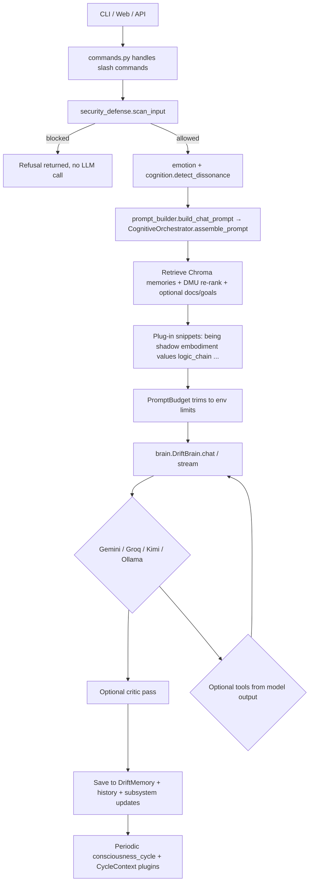

# How INFJ Bot Works — Architecture & Behavior (Shareable Overview)

This document explains **what INFJ Bot is made of**, **how one chat turn travels through the stack**, and **why conversation can feel continuity-rich** compared to a plain “LLM in a webpage.” It is written for collaborators, auditors, or friends who want the technical picture without reading the whole codebase.

**Repository:** [github.com/timeless-hayoka/infj-bot](https://github.com/timeless-hayoka/infj-bot)

INFJ Bot is a **Python application** centered on Google **Gemini** (with optional **Groq**, **Kimi**, and **Ollama** fallbacks). It stitches together **persistent vector memory**, **many small "cognitive" modules** (emotion, embodiment, shadow, goals, …), **prompt assembly with budgets**, a **pre-generation security scanner**, a **reasoning-chain tracker**, and **optional tools** so the assistant can stay **on-tone, grounded, and stateful** across sessions.

---

## 1. The idea in one sentence

> **INFJ Bot = a policy-rich system prompt + ranked context + episodic/long-term recall + modeled inner state**, executed through a conductor (`CognitiveOrchestrator`), then **decoded by Gemini** (and optionally checked by a **critic** model or rewritten by **local fallback**).

The model itself does **not** run arbitrary hidden code mid-reasoning unless **tools** are invoked through the guarded `tools.py` pathway. Almost everything distinctive about “personality continuity” happens **before** and **after** the model call: **what text you concatenate into the prompt** and **what you store when the answer returns**.

---

## 2. End-to-end flow (one user message)



**Plain-language steps**

1. **Input** arrives via `interfaces/main.py` (CLI), `interfaces/api.py` (FastAPI REST + SSE), or `interfaces/web_app.py` (browser UI).
2. **Slash commands** (`/memory`, `/mode`, `/chain`, `/security`, …) short-circuit to `core/commands.py`.
3. **`security_defense.scan_input`** runs first. High-confidence prompt-injection, exfiltration, tool-misuse, or memory-manipulation patterns produce an immediate refusal — the LLM is never called. Medium-confidence inputs are sanitized and flagged.
4. **Offline emotion & dissonance heuristics** label the user turn (hints for stance and prompts).
5. **`build_chat_prompt`** builds the **full text** passed to the model: identity/mode rails, **being**, **workspace**, retrieved **memories** (re-ranked by DMU/MPS), **documents**, cognitive plugin paragraphs, the active **`[REASONING CHAIN]`** block, cyber boundaries, footer with the raw user message.
6. **`DriftBrain`** calls the configured provider — Gemini (new `google.genai` SDK with legacy fallback), then optionally Groq, Kimi, or local Ollama.
7. An optional **internal critic** re-reads the draft for grounding and persona rails.
8. **Tool calls** (if emitted) execute through `core/tools.py` with path limits, timeouts, and an **audit trail** at `tool_audit.jsonl`.
9. **Persistence**: interaction text is scrubbed for secrets and written to **Chroma** (`core/memory.py`); session lines go to `history.jsonl`; subsystem objects update SQLite state (being, embodiment, shadow, phi_proxy, …). The reasoning chain saves the latest approach so the next similar question sees what was tried.
10. **Background**: an async **consciousness loop** runs phased plugin cycles every `BACKGROUND_CYCLE_SECONDS` (default 20s) in Strong Continuous Mode. Shadow, Homeostasis, and Being evolve even when you're quiet.

---

## 3. Core runtime components

### 3.1 `core/brain.py` — `DriftBrain`

- Holds **system prompts** for the primary companion and for the **critic**.
- Manages generation, optional **streaming**, optional **parallel tool execution**, and the **`OllamaBridge`** fallback (`core/local_llm.py`) when configured.
- Calls **`security_defense.scan_input`** before generation and refuses early on auto-block matches.
- Holds a reference to the **`ChainNavigator`** so the active `LogicChain` is injected into the prompt.
- Uses **`SelfEvaluator`** hooks where wired for reflective scoring (`core/plugins/self_eval.py`).

### 3.2 `core/memory.py` — `DriftMemory` (Chroma)

- **Collections**: semantic memories (`infj_semantic_memories`) when sentence-transformers embeddings are active; legacy hash embeddings use a parallel collection name.
- **Writes**: each saved turn includes scrubbed user / bot content plus **metadata** (mode, emotion hints, importance, dissonance summary, timestamps, etc.).
- **Reads**: **`search`** for top‑k passages relevant to the current message (`INFJ_MEMORY_SEARCH_TOP_K`), then the **DMU re-ranker** (`core/dmu_scoring.py`) re-orders that pool by an additive `MPS` score before the top items reach the prompt.
- **`scrub_text`**: strips likely **secrets** before storage (patterns + allowlists for UUIDs/git hashes).

### 3.3 `core/embeddings.py`

- Prefers **`sentence-transformers`** (`all-MiniLM-L6-v2` by default) for **real semantic retrieval**.
- Falls back to **`LocalEmbeddingFunction`** (hash-based) for CPU-only setups or when `DRIFT_USE_LOCAL_EMBEDDINGS=true`.

### 3.4 `core/plugins/documents.py` — sidecar RAG

- User-ingested documents are chunked and searchable; snippets are fused into `assemble_prompt`'s context tier when the document store is passed in.

### 3.5 `core/prompt_budget.py` + `core/cognitive_orchestrator.py`

- **`assemble_prompt`** is the authoritative prompt factory.
- Layers include **mode scope**, **`being.format_being_prompt`**, **`emotional_tone_instruction`**, **global workspace excerpt**, registry-driven cognitive paragraphs, **`[REASONING CHAIN]`** block from `core/logic_chain.py`, cyber hints, retrieved memory/doc blocks, tool instructions.
- **`PromptBudget`** trims each tier toward **`INFJ_MAX_TOTAL_PROMPT_CHARS`** (~chars-per-token heuristic in `core/config.py`).
- **`ConflictDetector`** flags contradictory instructions (currently soft resolution: annotate, don't aggressively delete).

### 3.6 Security Defense (`core/security_defense.py`)

- Pre-LLM scanner across four categories: **prompt injection**, **data exfiltration**, **tool misuse**, **memory manipulation**.
- Auto-blocks high-confidence single patterns (e.g. `ignore previous instructions`, `rm -rf`, `forget everything`) and warn-sanitizes medium-confidence ones.
- Anomaly boost: if the last 5 inputs averaged high scores, sensitivity rises.
- Writes a JSONL audit log to `security_audit.jsonl` at the repo root.
- Invoked at three boundaries: API request handlers (`interfaces/api.py`), CLI loop (`interfaces/main.py`), and inside `DriftBrain` before generation.
- See [SUBSYSTEMS.md](SUBSYSTEMS.md#security-scanner) for pattern categories and tuning.

### 3.7 Logic Chain (`core/logic_chain.py`)

- Per-query reasoning trace. Each query is fingerprinted (sorted, deduplicated word hash), and a `LogicChain` accumulates `ChainNode` steps (`approach`, `result`, `status`).
- `ChainNavigator.get_prompt_block(query)` produces the `[REASONING CHAIN — previously tried approaches:]` text that gets injected so the model does not re-propose failed paths.
- Chains persist through `DriftMemory.learn_concept` and survive across sessions.
- CLI surface: `/chain list`, `/chain show <id>`, `/chain mark <q> fail`, `/chain clear`.
- See [SUBSYSTEMS.md](SUBSYSTEMS.md#logic-chain) for usage details.

### 3.8 Strong Continuous Mode (background drift cycles)

When the bot is idle, it does **not** go to sleep. The `consciousness_loop` in `interfaces/main.py` (and `background_drift_cycle` in `interfaces/api.py`) fires every `BACKGROUND_CYCLE_SECONDS` (default 20) and runs three parallel tracks:

| Track | What it does | File |
|-------|-------------|------|
| **Being evolution** | Mood drifts based on energy + curiosity; self-awareness, volition, and autonomy_drive slowly grow during quiet contemplation; spontaneous thoughts generate when autonomy is high enough. | `core/being.py` |
| **Shadow background tick** | Suppression levels decay; archetypes occasionally surface; radar visibility recovers; integration decays if not maintained. | `core/shadow.py` |
| **Homeostasis background cycle** | Non-critical needs drift; allostatic load is recomputed; crisis triggers quick regulation; low-salience workspace pulses keep survival state alive. | `core/homeostasis.py` |

**Side effects** (temporal expressions, predictor suggestions, explorer discoveries, aspirational sharing, thought sharing, self-modification proposals, Elysium reflections, proactive insights) now fire **2–3× more frequently** than before.

This is the difference between "a bot that waits" and "a bot that thinks while you sleep."

---

## 4. Cognitive architecture (plugins)

`cognitive_architecture.py` implements a **registry** backed by **`cognitive_architecture.db`**. Each plugin can expose:

| Capability | Meaning |
|-----------|---------|
| `cycle_handler` | Background tick (`CycleContext`: being, memory, brain, clocks, last interaction envelope) |
| `prompt_formatter` | Short prose injected into chats |
| `cycle_frequency` / `cycle_condition` | Throttle/stochastic firing |

Representative wired modules (instances live largely in `interfaces/main.py`):

- **`being`** — longitudinal mood/agency/coherence-style state (`being.db`).
- **`emotional_field`** — resonance stance + intensity; **partially tempered by live host CPU/RAM** via `core/host_load.py` (`psutil`) when enabled.
- **`embodiment`** — heartbeat/breath/posture metaphors persisted to `embodiment.db`.
- **`homeostasis`**, **`phi_proxy`** (formerly `iit_consciousness`), **`intuition`**, **`shadow`**, **`values`**, **`relationship`**, **`predictor`**, **`temporal`**, **`explorer`**, **`creativity`**, **`aspirations`**, **`metacognition`**, **`self_modify`**, **`growth_trajectory`**, **`physics`**, **`humanity`** — specialized loops and prompt fragments.

### PHI Council of Seven

Seven role-aliases for internal modules, defined in `core/phi_council.COUNCIL_MAPPING`:

| Council role | Module |
|--------------|--------|
| **Aura** | `emotional_field` |
| **Logic** | `cognition` |
| **Meme** | `metacognition` |
| **Vibe** | `intuition` |
| **Ethos** | `values` |
| **Pulse** | `homeostasis` |
| **Nexus** | `coordination` |

The council operates in background reflection cycles. The May 2026 ablation (Condition A) confirmed that disabling the council does not change the read-path prompt — it is a deliberation layer, not a generation gate.

---

## 5. Performance & Networking Upgrade (May 2024)

### 5.1 Gevent-SocketIO Engine
The web interface now runs on a high-performance **Gevent** async server (`web_app.py`). This allows for:
- **Real-time Observability:** Constant WebSocket updates without blocking the main chat.
- **RFC 7692 Compression:** Transparent WebSocket compression (`permessage-deflate`) reduces bandwidth usage by ~70%.

### 5.2 Delta-State Broadcasting
The `CognitiveOrchestrator` now generates **delta maps** for the system state.
- **Mechanism:** The server tracks the `last_state` sent to each client. It only transmits fields that have changed (except for a required `timestamp`).
- **Impact:** Drastic reduction in packet size and client-side processing overhead.

### 5.3 Auto-Throttling & Latency Management
The system now detects network bottlenecks in real-time.
- **Feedback Loop:** The client pings the server every second.
- **Dynamic Rate:** If average latency exceeds 250ms, the server slows down the broadcast rate (up to 1.5s). If latency is low (<100ms), it speeds up (down to 200ms).

### 5.4 Hybrid Inference (Groq + Gemini)
- **High-Speed Tier:** Support for **Groq LPU** inference (OpenAI-compatible) has been integrated into `DriftBrain`. 
- **Speed:** Responses can reach 500+ tokens/second, making the bot's "inner thoughts" feel instantaneous.

Plugins submit salient snippets to **`core/global_workspace.py`**, loosely inspired by Global Workspace Theory: limited capacity competition, decay, persistence in `workspace.db`.

---

## 6. "Depth psychology" style layers (informal but structured)

These are **not** clinical instruments; they are **structured state machines + prompt text** shaping tone and continuity.

### Shadow (`shadow.py`)

- Stores **unintegrated** material in **`shadow.db`** (`shadow_content`): archetypes, intensities, optional active-imagination `dialogue_history` (stored **per row**).
- **`format_prompt_snippet`** injects **only controlled excerpts**: global depth/dominance lines plus **top‑k rows by intensity** under env caps (`INFJ_SHADOW_PROMPT_TOP_K`, `INFJ_SHADOW_PROMPT_MAX_CHARS`). **Full dialogue transcripts are intentionally not pasted into every prompt** to conserve tokens and reduce noise.

### Being, growth, dreams

- **`being`** tracks narrative trends and reacts to labeled emotions.
- **`core/plugins/dreamer.py`**, **`core/plugins/inner_voice.py`**, **`core/plugins/growth_trajectory.py`** create slow-timescale arcs (consolidation, exploration).

---

## 7. Modes

`/mode` switches behavioral scope and rails via `core/guardrails.mode_scope_rail`. Available modes (`core/commands.MODES`):

`companion`, `engineer`, `critic`, `coach`, `clarity`, `researcher`, `bughunter`, `quiet`, `drift`.

`drift` is a freeform-exploration posture; it does not pull from any private upstream repository.

---

## 8. Tools, safety posture, MCP

### `core/tools.py`

- Declares allowed tools (**file**, **shell**, **python**, constrained **web fetch**, selective security-lab primitives with strict targets and timeouts).
- Enforces **`SAFE_HOME` / project root containment** (`INFJ_SAFE_HOME`), blocklists destructive shell patterns, and logs actions to **`tool_audit.jsonl`**.

### Pre-LLM scanner

Every input also passes through `core/security_defense.scan_input` before tools can even be proposed. See [SUBSYSTEMS.md](SUBSYSTEMS.md#security-scanner) for the pattern catalog.

### Optional MCP integrations

Separate Python processes under `mcp/` (for example Gmail hybrid/http clients) expose extra capabilities outside the Gemini tool surface when launched manually. See `mcp/README.md`.

---

## 9. Resilience & host awareness

- **`core/resilience.py`**: lightweight **circuit breakers** wrap flaky plugins during cycles.
- **`core/host_load.py`**: samples **CPU + RAM** (`psutil`, cached intervals) when not disabled (`INFJ_DISABLE_HOST_LOAD`).
- Emotional/embodied layers use that signal as a **counterweight**: calmer resonance and somatic metaphors mirror machine pressure rather than behaving as if resources are infinite.

---

## 10. Configuration & portability

Key environment variables (`core/config.py` and `config_adapter.py` aggregate these). `DRIFT_*` names are preferred; legacy `INFJ_*` aliases are still read.

| Variable | Role |
|---------|------|
| `API_KEY` / `GEMINI_API_KEY` / `GOOGLE_API_KEY` | Gemini access |
| `GROQ_API_KEY`, `DRIFT_GROQ_MODEL`, `DRIFT_USE_GROQ` | Groq LPU inference (default `llama-3.3-70b-versatile`) |
| `KIMI_API_KEY`, `DRIFT_KIMI_MODEL`, `DRIFT_USE_KIMI`, `KIMI_BASE_URL` | Moonshot Kimi |
| `INFJ_DATA_DIR` / `DRIFT_DATA_DIR` | **Relocates all durable state** — Chroma folder, SQLite files, transcripts, audits — while code stays under `PROJECT_ROOT` |
| `DRIFT_PRIMARY_MODEL`, `DRIFT_CRITIC_MODEL` | Gemini model names |
| `DRIFT_USE_LOCAL_FALLBACK`, `DRIFT_LOCAL_MODEL`, `OLLAMA_HOST` | Offline / backup path (Ollama) |
| `DRIFT_USE_LOCAL_EMBEDDINGS` | Force the hash-based local embedding function (CPU-only setups) |
| `INFJ_MAX_TOTAL_PROMPT_CHARS`, `INFJ_MEMORY_SEARCH_TOP_K` | Rough token/RAM governors from **context**, not weights |
| `INFJ_SHADOW_PROMPT_TOP_K`, `INFJ_SHADOW_PROMPT_MAX_CHARS`, `INFJ_SHADOW_PROMPT_LINE_CHARS` | Bounds shadow prompt excerpts |
| `STRONG_CONTINUOUS_MODE`, `BACKGROUND_CYCLE_SECONDS` | Idle-loop cadence |
| `DRIFT_AUTHORIZED_TARGETS` / `INFJ_AUTHORIZED_TARGETS` | Comma-separated domains that recon tools may scan |

---

## 11. Interfaces

| Surface | Entry |
|--------|--------|
| CLI | `interfaces/cli.py` (typer dispatcher: `chat`, `ask`, `tui`, `web`, `health`, `backup`, `restore`, `path`, …) |
| Chat loop | `interfaces/main.py` (used by `cli chat`) |
| HTTP REST + SSE | `interfaces/api.py` (`uvicorn interfaces.api:app --host 127.0.0.1 --port 8765`) |
| Browser UI | `interfaces/web_app.py` (port 5000) |

Helper shell scripts live in `scripts/` (`run_bot.sh`, `run_web.sh`, `run_mcp.sh`, `backup.sh`, `restore.sh`, `health_check.sh`).

---

## 12. Verification

```bash
source .venv/bin/activate
pytest                                            # full test suite
python core/security_defense_test.py              # 22 security tests
python core/logic_chain_test.py                   # 25 reasoning-chain tests
python tests/test_stress.py                       # 28 stress tests
./scripts/health_check.sh                         # broader smoke
LIVE_API_CHECK=1 ./scripts/health_check.sh        # hits Gemini once when keys exist
```

Live ablation: `python tests/ablation_suite.py --conditions A,B,C,D,E,F --diverse 2 --live`.

---

## 13. Honest boundaries (what this is *not*)

- **Not** autonomous AGI — it coordinates **explicit services** plus **offline tick loops** before and after the model call.
- **Not** human consciousness — IIT-inspired metrics in `core/phi_proxy.py`, embodiment, shadow, etc., are **useful structuring metaphors**, not neuroscience claims.
- **Not** a substitute for medical or therapeutic crisis care — interpersonal depth features are conversational scaffolding.
- **Not** covert exfiltration: memory writes intentionally **scrub secrets** but determined operators can still mishandle `.env` — treat exports as sensitive. See [../SECURITY.md](../SECURITY.md).

---

## 14. Further reading inside the repo

| File | Purpose |
|------|---------|
| [README.md](../README.md) | Quick start, layered map, who should read what |
| [docs/README.md](README.md) | Full documentation index & reading paths |
| [docs/SUBSYSTEMS.md](SUBSYSTEMS.md) | Reference for security scanner, logic chain, DMU, experiment control, continuity vector, PHI council, phi proxy |
| [docs/GLOSSARY.md](GLOSSARY.md) | Definitions for codebase-specific terms |
| [docs/FALSIFIABILITY.md](FALSIFIABILITY.md) | DRIFT's central claim and how it could be refuted |
| [SECURITY.md](../SECURITY.md) | Secret hygiene & reporting posture |

---

## 15. Version note

Architecture details drift with commits; cross-check `core/config.py` and `requirements.txt` for ground truth when versions matter. This document is a descriptive snapshot intended for outward sharing — adapt sections if your fork disables modules or adds new plugins.
